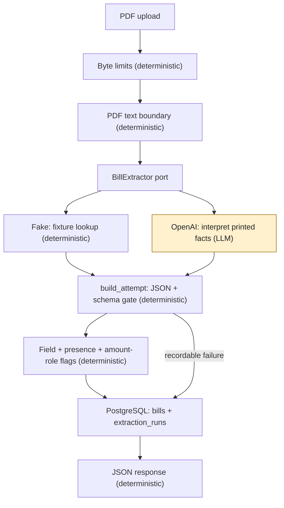

# Bill Lens

Turn messy Victorian household electricity bill PDFs into structured, validated,
explainable data, with a record of what was extracted and why it needs review.

> Use probabilistic AI where ambiguity exists. Use deterministic software where correctness can be guaranteed. Measure both.

## Evidence so far

**Small synthetic text-PDF samples, not real-world accuracy.** Counts below are
attempts, including repeated calls on the same bills; they are not independent layouts.

- **v2 avoided the planted non-retailer traps in 15/15 dev attempts.** Retailer was
  correct in 12/15: two logo/name selections exposed a specification gap; one
  missing name remained an extraction miss. [Evidence](docs/learning/retailer-brand-evaluation.md#execution-and-provenance)
- **v4 retailer selection: 15/15 dev and 18/18 holdout attempts**, on five dev and
  six previously unevaluated holdout bills. The holdout contained no amount-due
  trap. [Results and limits](docs/learning/retailer-brand-evaluation.md#holdout-interpretation-and-next-decision)
- **bill_002 repeat study: 0/20 v2 versus 2/20 v4 false extractions.** This does
  not establish a regression; Fisher's two-sided p is approximately
  0.49. The failures used a wrong printed total and an unprinted total.
  [Saved outcomes](docs/learning/evidence/retailer-brand-v4/repeat-study-statistics.json) · [Fisher method and result](docs/learning/retailer-brand-evaluation.md#fisher-exact-comparison)
- **Deterministic presence checking reduced silent false acceptances from 3/88
  to 2/88 preserved attempts**, with zero new false reviews among those attempts
  and zero model calls. It caught the unprinted total; the printed distractor
  still passes presence alone. [Offline replay](docs/learning/retailer-brand-evaluation.md#m3-offline-printed-value-replay)
- **A Python current-amount label check then reduced 2/88 to 0/88**, with zero
  new false reviews and zero model calls. Both saved amount-due errors now reach
  review; values are not repaired.
  [Role replay and limits](docs/learning/retailer-brand-evaluation.md#m3-offline-current-amount-role-replay)
- **On a fresh, owner-verified synthetic role holdout**, the frozen check sent
  **6/9** correct current amounts to review (3/6 layout traps; 3/3 unfamiliar
  labels) and caught **40/40** chosen signed distractors. Hand predictions and
  measurements agreed on **49/49** values. This offline counterfactual is not a
  real-bill error rate or a live model result.
  Main commits: predictions `bf6f32c` (original branch `9fc8131`), measurement
  `ef1bbf7` (original branch `a8f5706`).
  [Method, per-shape counts and limits](docs/learning/current-amount-role-holdout.md)
- **Live v4 on that role holdout: 27/27 printed current amounts correct; r07
  correctly null in 3/3 attempts.** There were **0/30** wrong numeric answers
  and silent false acceptances, but the frozen role check falsely reviewed
  **18/27** correct printed amounts. This one model/prompt on ten selected
  synthetic bills does not establish a real-world error rate.
  [Live results, cost and recommendation](docs/learning/current-amount-role-holdout.md#live-v4-model-run-2026-10-01)

## Architecture

Python, FastAPI, pdfplumber, Pydantic, SQLAlchemy/Alembic and PostgreSQL; an OpenAI
adapter sits behind a provider-independent extraction interface. Local development
defaults to a deterministic fake. A new upload follows this path:



The LLM identifies printed facts; Python owns date arithmetic, unit conversion
and review rules. A schema-valid answer can still be wrong. Flags preserve the
returned value for review instead of silently repairing it. PDFs use opaque local
storage keys; raw responses and attempt history remain separate from public JSON.
No DB connection is held during extraction. See the [contract](docs/extraction-contract.md)
and [upload design](docs/adr/005-upload-api.md) for duplicate and failure paths.

## Engineering decisions

| Decision record | Choice | Cost or limit |
| --- | --- | --- |
| [ADR-001](docs/adr/001-pdf-extraction-strategy.md) | Inspectable PDF text before model extraction | Reading order can lose layout; no OCR. |
| [ADR-002](docs/adr/002-extraction-port.md) | BillExtractor port, recordable attempts, shared schema gate | Fake tests exercise plumbing, not model accuracy. |
| [ADR-003](docs/adr/003-persistence-model.md) | Separate bill identity from run history; UNIQUE hash and atomic writes | JSONB needs application validation; real PostgreSQL tests add setup. |
| [ADR-004](docs/adr/004-lossless-raw-response.md) | Reject invalid field controls; retain raw strings losslessly in BYTEA | Direct readers need the codec; unsafe downgrades fail rather than lose evidence. |
| [ADR-005](docs/adr/005-upload-api.md) | Release connections during extraction; let UNIQUE settle races | Simultaneous identical uploads can pay for a duplicate call; file/DB commits are not atomic. |
| [ADR-006](docs/adr/006-first-provider.md) | Opt-in OpenAI, versioned prompt and schema instructions | Owner had API credit; this was not a measured provider comparison. |
| [ADR-007](docs/adr/007-retry-failed-reupload.md) | Explicit re-upload retries append history; lock short status updates | Repeated retries can spend during an outage; no background recovery. |
| [ADR-008](docs/adr/008-evaluation-harness.md) | Deterministic scoring, manual labels and hashed file artifacts | Small synthetic sets cannot establish generalisation. |
| [ADR-009](docs/adr/009-printed-value-check.md) | Check printed-value presence and route unsupported values to review | A number printed in the wrong role still passes; formatting can cause false reviews. |
| [ADR-010](docs/adr/010-current-amount-role-check.md) | Check current-amount labels in Python before requesting evidence spans | Limited vocabulary and flattened columns can misassociate values; fresh holdout needed. |

## Evaluation

The harness uses the production extraction and review functions against a
[golden development set](dataset/README.md) and a separate
[retailer holdout](dataset/holdout/README.md). Labels are independently authored
from the PDF generator and checked by the owner; their flags are not regenerated
from the code being tested. The designer is still shared, so verification does
not remove shared-author bias.

Each field receives one of `correct`, `wrong_value`, `missing`,
`false_extraction` (expected null, returned non-null), or `no_fields` (failed
attempt). Failures stay in the denominator. Exact field match, review decisions,
usage and latency are reported separately. Repeats expose variable correctness;
a perfect fake score only checks the harness.

Historical model runs below used scoring version 1 and gpt-5.4-mini. **These are
small synthetic samples, not real-world accuracy.** Dev and holdout are shown
separately; repeated calls do not add new layouts.

| Measure | v2 dev: 5 bills × 3 | v4 dev: same 5 × 3 | v4 holdout: 6 bills × 3 |
| --- | ---: | ---: | ---: |
| Retailer correct | 12/15 | 15/15 | 18/18 |
| Current amount correct | 15/15 | 14/15 | 18/18 |
| All fields correct together | 12/15 | 14/15 | 18/18 |
| Review status correct | 15/15 | 14/15 | 18/18 |

Sources: [v2 dev](docs/learning/evidence/retailer-brand-v4/v2-dev/report.md),
[v4 dev](docs/learning/evidence/retailer-brand-v4/v4-dev/report.md),
[v4 holdout](docs/learning/evidence/retailer-brand-v4/v4-holdout/report.md).
The [learning note](docs/learning/retailer-brand-evaluation.md) explains the
specification change, amount-due failure, repeat study and preserved provenance.

Comparisons refuse incomplete runs, different PDF/label hashes, unequal repeat
counts and incompatible harness/scoring versions. They warn when multiple
experimental settings differ. Presence introduced scoring version 2; the
current-amount role rule uses version **3**. Historical artifacts stay unchanged
and are analysed through separate offline replays, not relabelled for comparison.
See the [evaluation guide](evals/README.md).

The holdout rule was fixed before authoring; labels were owner-verified before
live use. Those bills are now evaluated, not still unseen. If their results are
used to tune a rule, promote them to development data and obtain fresh holdouts.
The existing holdout has no amount-due trap and cannot validate a fix for that class.

## Problems found by review, not by the passing suite

These are observed defects and test gaps in earlier revisions, not current
production incident rates. Review used extra probes, fuzzing and mutation checks.

| What the suite missed | How review found it | Fix and record |
| --- | --- | --- |
| Parser exceptions escaped the PDF boundary | Fuzzing: 59 escapes in 9,000 malformed synthetic inputs | Guard parser calls; all 59 became classified failures, other outcomes unchanged. [Evidence](docs/learning/pdf-boundary-fuzzing.md#post-fix-replay-results), [PR #3](https://github.com/maxtsec/bill-lens/pull/3) |
| Duplicate JSON keys silently kept the last value | Adversarial JSON probes | Reject duplicates before parsing loses them; preserve raw output. [PR #4](https://github.com/maxtsec/bill-lens/pull/4#issuecomment-5854033704) |
| NUL and lone surrogates could not be stored | A Python-valid attempt failed PostgreSQL insertion | Validate field controls and store raw strings losslessly. [PR #5](https://github.com/maxtsec/bill-lens/pull/5#issuecomment-5860771520) → [PR #6](https://github.com/maxtsec/bill-lens/pull/6#issuecomment-5861400708) |
| Metadata exceeded BIGINT capacity | Review compared Python validation with DB limits | Bound latency/token counts; test the maximum and overflow in both layers. [PR #6](https://github.com/maxtsec/bill-lens/pull/6#issuecomment-5861400708) |
| Nested connection checkout exhausted the pool | Concurrent distinct uploads with a blocking extractor and small pool | Remove advisory locks; hold no connection during extraction. [PR #7](https://github.com/maxtsec/bill-lens/pull/7#issuecomment-5861692033) |
| A transient outage became a permanently cached failure | Re-upload after a simulated rate limit recovered | Retry transient failures on re-upload and append history. [PR #8](https://github.com/maxtsec/bill-lens/pull/8#issuecomment-5877184203) → [PR #9](https://github.com/maxtsec/bill-lens/pull/9) |
| Tests passed with the row lock removed | Mutation test exposed an untested status-update interleaving | Deterministic concurrent regression now fails without the lock. [PR #9](https://github.com/maxtsec/bill-lens/pull/9#issuecomment-5877888011) |
| Sentence punctuation and spaced dashes caused false review flags | Correct-amount text probes outside the synthetic layouts | Accept trailing punctuation; only attached minus signs negate values. [PR #15](https://github.com/maxtsec/bill-lens/pull/15#issuecomment-5881232308) |

## Security and data handling

- PDF text and model output are untrusted. The [PDF boundary](docs/pdf-text-boundary.md#acceptance-policy)
  limits file bytes, pages and extracted characters; the [upload layer](docs/adr/005-upload-api.md#two-byte-limits)
  also counts actual request bytes. These are acceptance limits, not CPU/memory isolation.
- Original upload filenames are never stored. The server generates PDF storage
  keys; raw model responses stay internal and are excluded from HTTP responses.
  Saved evaluation artifacts deliberately contain raw output from **synthetic data only**.
- The [prompt boundary](docs/adr/006-first-provider.md#prompt-and-document-boundary)
  separates instructions from text with unique delimiters and gives the model no
  tools. This is **not a complete defence** against prompt injection. Presence
  checking is also not a security boundary.
- OpenAI mode sends extracted page text to the provider. `store=False` is not a
  zero-retention guarantee. Real customer use needs a privacy/retention decision.
  API keys belong in ignored local configuration or the process environment.

## How it was built

Max owns scope, trade-offs, label verification and permission for paid runs.
Codex implements a scoped branch; Claude reviews it with must-fix and
should-consider findings, including independent probes and mutation checks.
Fixes return for review before owner-authorised rebase merges. The
[pool-lock decision](https://github.com/maxtsec/bill-lens/pull/7#issuecomment-5861709771)
and [row-lock re-review](https://github.com/maxtsec/bill-lens/pull/9#issuecomment-5878127276)
show that process. Review by another model helps find gaps; it does not replace
owner judgement or independently measured evidence.

## Known limitations

- Small, synthetic text-PDF datasets; no real or scanned bill accuracy measurement,
  OCR, adversarial evaluation or production load evidence.
- OpenAI is the only real provider adapter. No measured provider comparison.
- Dates are not checked for printed presence. Current-amount labels are a
  limited heuristic: unknown wording can cause false reviews and flattened
  columns can confirm the wrong amount. Common numbers and retailer substrings
  can match unrelated text; real-bill role coverage is unmeasured.
- No authentication; local development only. No deployed service, distributed
  jobs, automatic orphan-file reconciliation or production retention policy.
- Existing stored results retain their historical decisions; new rules do not
  silently re-extract or backfill them.

## Roadmap candidates

- PR B: fresh held-out bills with varied wording, an amount-due trap, tables
  and number-above-label boxes before claiming the role safeguard generalises.
- Evidence spans **plus label/context verification** only if the Python-first
  check proves insufficient; a matching span alone cannot establish a role.
- M4 period comparison, once extraction and review semantics support it.

These are candidates, not delivered features or delivery promises.

## Quick start

The local [bill workbench](docs/development.md#bill-workbench-and-human-review)
now provides bill browsing, PDF previews and versioned human confirmation or
correction. Extraction results and human decisions remain separate; see
[ADR-011](docs/adr/011-human-review-workbench.md).

From the repository root, using Python 3.12+ in PowerShell:

```powershell
python -m venv .venv
.\.venv\Scripts\python.exe -m pip install -r requirements-dev.txt -e ".[dev]"
.\.venv\Scripts\python.exe -m pytest -m "not db" -q
.\.venv\Scripts\python.exe -m evals.run --extractor fake
```

This needs no API key or database and makes no model call. Fake scores are not
extraction accuracy. For PostgreSQL, migrations, local uploads, tests and
explicitly paid checks, use the [development guide](docs/development.md).
